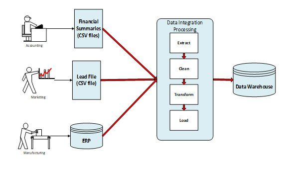
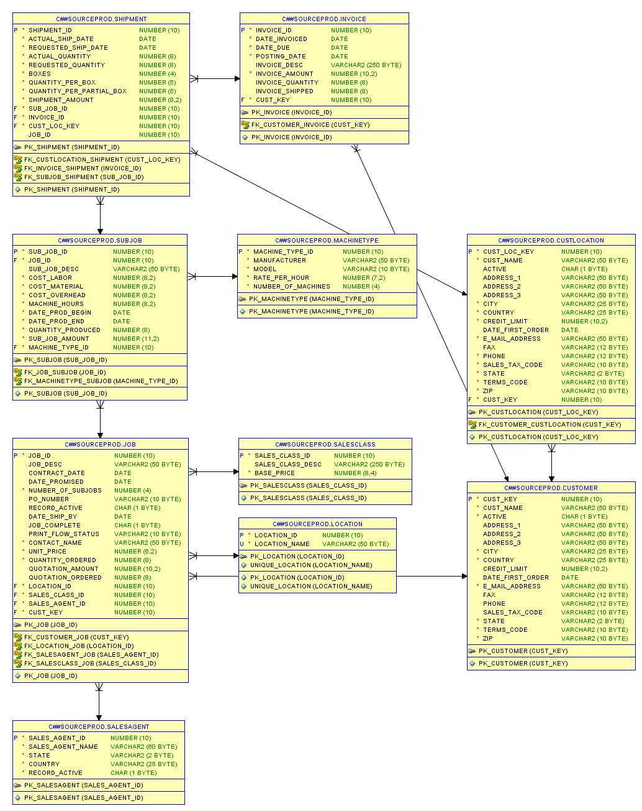
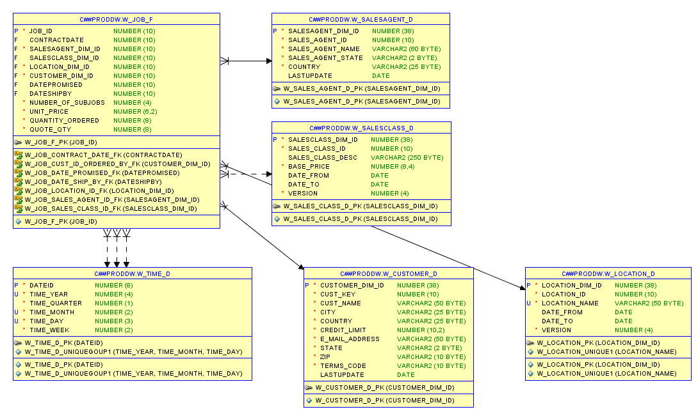
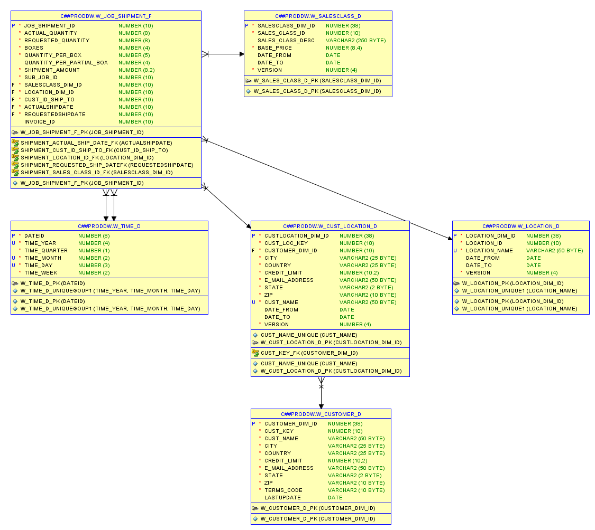
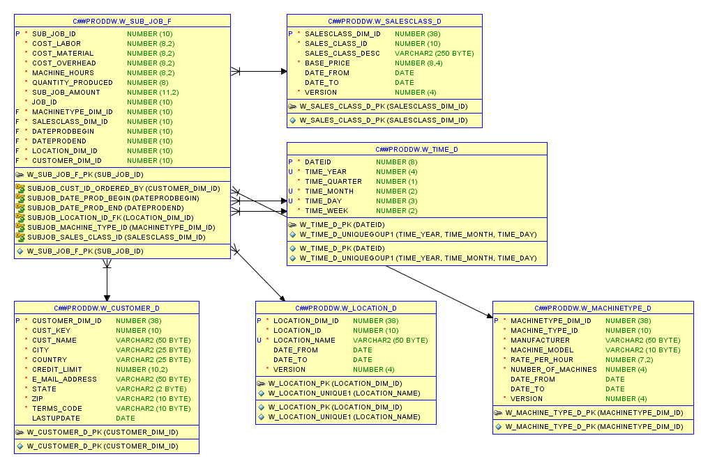
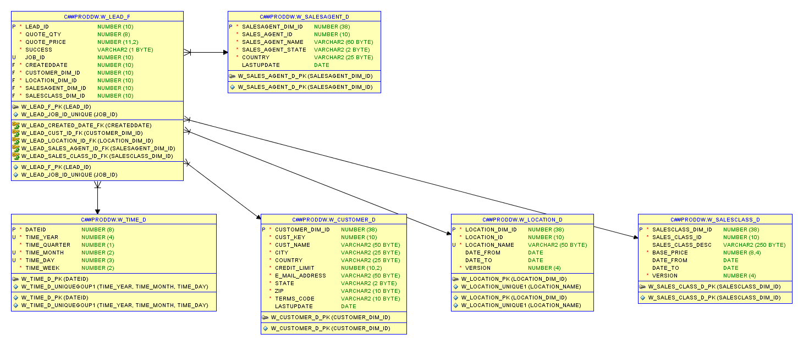
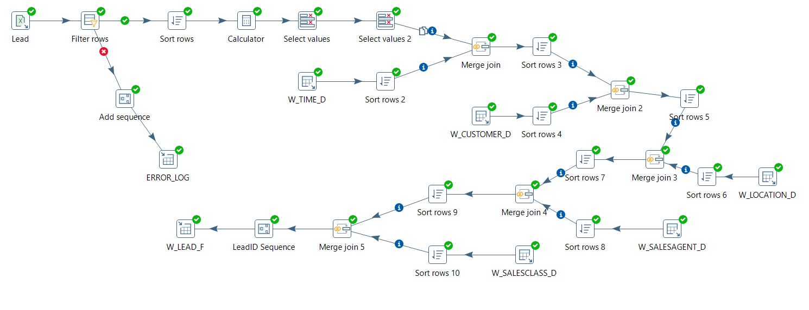
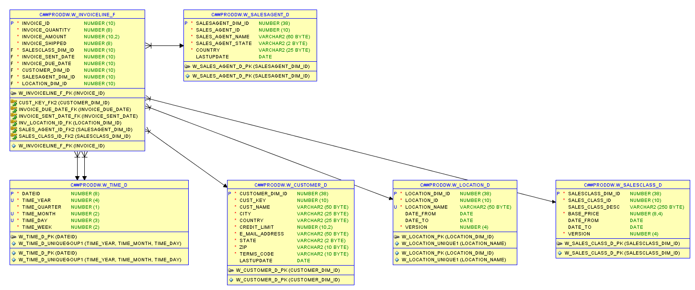
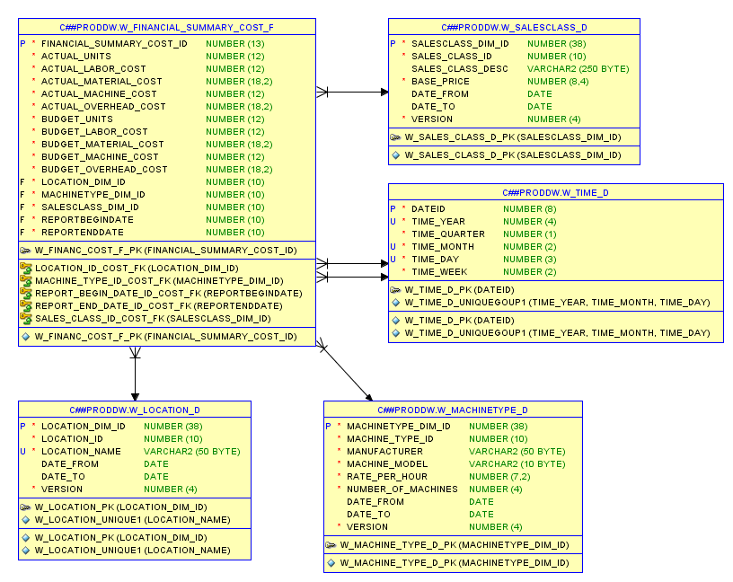
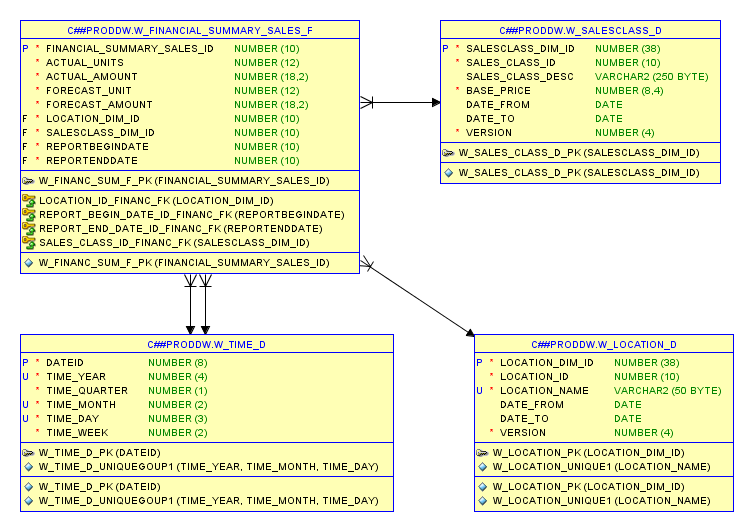

# 
The CPI Card Datawarehouse

The data warehouse uses three data sources as depicted below. The ERP database is the major source used by manufacturing to manage jobs, subjobs, shipments and invoices. The lead file and financial summaries are secondary data sources, both in spreadsheet format. The lead file and financial summary are prepared from other data sources used by the marketing and accounting departments.

**Tools used in this project:**

*  Oracle SQL Developer 4.1
*  ER Assistant 2.10
*  Oracle SQL Developer Data Modeler
*  Microstrategy Desktop 11
*  Oracle Database 12.2
*  Pentaho Data Integrator 8.2
*  Toad for Oracle 13.0 for data generation
*  Microsoft Excel 2016 Professional

## [**Source System:**](#sourcesystem)

**Primary source : The ERP Database**
1. [Entity relationship Diagram](#erdss)
2. [Table Row Counts](#tcss)
3. [Table Descriptions](#tdss)
4. [Source System SQL Scripts](#ssss)

**Secondary sources:**

* [Lead file]()
* [Financial summaries]()

## [**Star Schemas design:**](#starschema)

1. [Job Star Schema](#jss)
   - Entity Relationship Diagram
   - Table Descriptions
   - Scripts To Create Tables
   - ETL
   - Verify Against Source System
2. [Shipment Star Schema](#sss)
   - Entity Relationship Diagram
   - Table Descriptions
   - Scripts To Create Tables
   - ETL
   - Verify Against Source System
3. [Subjob Star Schema](#sjss)
   - Entity Relationship Diagram
   - Table Descriptions
   - Scripts To Create Tables
   - ETL
   - Verify Against Source System
4. [Lead Star Schema](#lss)
   - Entity Relationship Diagram
   - Table Descriptions
   - Scripts To Create Tables
   - ETL
   - Verify Against Source System
5. [Invoice Schema](#iss)
   - Entity Relationship Diagram
   - Table Descriptions
   - Scripts To Create Tables
   - ETL
   - Verify Against Source System
6. [Financial Cost Summary Star Schema](#fcss)
   - Entity Relationship Diagram
   - Table Descriptions
   - Scripts To Create Tables
   - ETL
   - Verify Against Source System
7. [Financial Sales Summary Star Schema](#fsss)
   - Entity Relationship Diagram
   - Table Descriptions
   - Scripts To Create Tables
   - ETL
   - Verify Against Source System

## [**ETL Jobs:**](#etljobs)

1. [Test Data Warehouse ETL Job](#testetl)
2. [Production Data Warehouse ETL Job](#productionetl)

## [**Analysis**](#analysis)

1. [SQL Base Queries](#bq)
2. [Analytical Queries](#aq)
3. [Materialized View Design](#mv)
4. [Summary](#summary)

#  
The Source System

### The primary data source: ERP Database
The ERP database supports complete processing for jobs involving planning, manufacturing, shipping, invoicing and payment processing as well as accounting. An abbreviated ERD for the subset of the ERP database relevant for the initial phase of the datawarehouse is shown below

### Entity Relationship Diagram

<a href="ERD/ERPDatabase.erd" download>ERPDatabase.erd</a>

### Table Row Counts

<table>
<tr>
   <th>Table Name</th>
   <th>Number of Rows</th>
</tr>
<tr>
   <td>Customer</td>
   <td>3000</td>
</tr>
<tr>
   <td>CustLocation</td>
   <td>10000</td>
</tr>
<tr>
   <td>Invoice</td>
   <td>1000000</td>
</tr>
<tr>
   <td>Job</td>
   <td>100000</td>
</tr>
<tr>
   <td>Location</td>
   <td>10</td>
</tr>
<tr>
   <td>MachineType</td>
   <td>10</td>
</tr>
<tr>
   <td>SalesAgent</td>
   <td>50</td>
</tr>
<tr>
   <td>SalesClass</td>
   <td>6</td>
</tr>
<tr>
   <td>Shipment</td>
   <td>2500000</td>
</tr>
<tr>
   <td>SubJob</td>
   <td>500000</td>
</tr>
<tr>
   <td>LeadFile</td>
   <td>250000</td>
</tr>
<tr>
   <td>Financial Sales Summary</td>
   <td>1800</td>
</tr>
<tr>
   <td>Financial Cost Summary</td>
   <td>5400</td>
</tr>
</table>

### Table Descriptions

<table>
       <tr>
           <th>Enty Type</th>
           <th>Comments</th>
       </tr>
       <tr>
           <td>Customer</td>
           <td>Organizations that request jobs. Customers are involved in quotes which are recorded in the CRM not in the ERP. In the ERP, customers are recorded in a job</td>
       </tr>
       <tr>
           <td>CustLocation</td>
           <td>Locations of customers to which cards are shipped.</td>
       </tr>
       <tr>
           <td>Invoice</td>
           <td>Collection of shipments billed to a customer. An invoice is created after related shipments so the Bills relationship is optional.</td>
       </tr>
       <tr>
           <td>Job</td>
           <td>A contract for a quantity of cards generated after a customer accepts a quote</td>
       </tr>
       <tr>
           <td>Location</td>
           <td>Location of the company that manages a job</td>
       </tr>
       <tr> 
           <td>MachineType</td>
           <td>Type of machine used to produce cards in a subjob</td>
       </tr>
       <tr>
           <td>SalesAgent</td>
           <td>Employee credited with obtaining a job</td>
       </tr>
       <tr>
           <td>SalesClass</td>
           <td>Type of product on a job</td>
       </tr>
       <tr>
           <td>Shipment</td>
           <td>Collection of cards shipped to a customer after production in a subjob</td>
       </tr>
       <tr>
           <td>Subjob</td>
           <td>Subset of a job produced using a machine type. Identification dependent on Job.</td>
       </tr>

</table>

### Source System SQL Scripts

To recreate the ERP at once run the <a href="SQL/sourcesystem/SourceSystemCreateStatements.sql" download>SourceSystemCreateStatements.sql</a> file to create the tables and 
<a href="SQL/sourcesystem/SourceSystemInsertStatements.sql" download>SourceSystemInsertStatements.sql</a> to insert the data. These files were tested on Oracle Database 12.2.2

For individual table creations and population run the files in order:

*  <a href="SQL/sourcesystem/Customer.sql" download>Customer.sql</a>
*  <a href="SQL/sourcesystem/CustLocation.sql" download>CustLocation.sql</a>
*  <a href="SQL/sourcesystem/SalesAgent.sql" download>SalesAgent.sql</a>
*  <a href="SQL/sourcesystem/SalesClass.sql" download>SalesClass.sql</a>
*  <a href="SQL/sourcesystem/Location.sql" download>Location.sql</a>
*  <a href="SQL/sourcesystem/MachineType.sql" download>MachineType.sql</a>
*  <a href="SQL/sourcesystem/Job.sql" download>Job.sql</a>
*  <a href="SQL/sourcesystem/Subjob.sql" download>Subjob.sql</a>
*  <a href="SQL/sourcesystem/Invoice.sql" download>Invoice.sql</a>
*  <a href="SQL/sourcesystem/Shipment.sql" download>Shipment.sql</a>

### Secondary data sources: The lead file and financial summaries

*  <a href="Spreadsheets/Lead.xls" download>Lead File</a>
*  <a href="Spreadsheets/FinancialCostSummary.xls" download>Financial Cost Summary</a>
*  <a href="Spreadsheets/FinancialSalesSummary.xls" download>Financial Sales Summary</a>

## 
Datawarehouse Design

Identifying dimensions, map dimensions to data sources and specify dimension hierarchies in each data cube. Identify data sources and attributes in each data source for each dimension.For hierarchical dimensions you should indicate the levels from broad to narrow. Specify measures and measure aggregation properties. Dimensions and measures are grouped. Dimensions and measures are put together in data cubes.

<table>
<tr>
<th>Dimension</th>
<th>Attributes</th>
<th>Hierarchies</th>
<th>Data Sources</th>
</tr>
        
<tr>
<td>Customer</td>
<td>Cust_Key,Cust_Name,Location,E_Mail_Address,Terms_Code</td>
<td>Country,State,City,Country,Zip</td>
<td>Customer table in ERP</td>
</tr>
       
<tr>
<td>Customer location</td>
<td>Cust_Loc_Key,Cust_Name Location E_Mai_Address Terms_Code</td>
<td>Country, State, City, Country,Zip Top level, second level domains</td>
<td>CustomerLoc table in ERP</td>
</tr>
       
<tr>
<td>Location</td>
<td>Location_Id, Location_Name</td>
<td> </td>
<td>Location table in ERP</td>
</tr>
       
<tr>
<td>Machine type</td>
<td>Machine_Type_Id, Manufacturer, Model, Rate_Per_Hour, Number_Of_Machines</td>
<td> </td>
<td>MachineType table in ERP</td>
</tr>
       
<tr>
<td>Sales Agent</td>
<td>Sales_Agent_Id, Sales_Agent_Name, Location</td>
<td>State, country</td>
<td>SalesAgent table in ERP</td>
</tr>
       
<tr>
<td>Sales class</td>
<td>Sales_Class_Id, Sales_Class_Desc</td>
<td> </td>
<td>SalesClass table in ERP</td>
</tr>
       
<tr>
<td>Time</td>
<td>Various dates: Date_Invoiced, Date_Due, Contract_Date, Date_Promised, Date_Ship_By, Date_Prod_Begin, Date_Prod_End,Actual_Shiip_Date, Requested_Ship_Date, Begin_Date, End_Date, Created_Date</td>
<td>Year, quarter, month, day, Year, week</td>
<td>Date columns in Job, Lead, Shipment, Subjob, Invoice, FinancialCostSummary, and FinancialSalesSummary</td>
</tr>

</table>

<table>
<tr>
<th>Data Source</th>
<th>Measures</th>
<th>Aggregation Properties</th>
</tr>
       
<tr>
<td>Lead</td>
<td>Success, Quote_Price, Quote_Qty</td>
<td>Non-additive Non-additive Additive</td>
</tr>
       
<tr>
<td>Job</td>
<td>Quantity_Ordered, Quotation_Amount, Quotation_Ordered</td>
<td>Additive Additive Additive</td>
</tr>
       
<tr>
<td>Subjob</td>
<td>Cost_Material, Cost_Labor, Cost_Overhead, Machine_Hours, Quantity_Produced</td>
<td>Additive Additive Additive Additive Additive</td>
</tr>
       
<tr>
<td>Shipment</td>
<td>Actual_Quantity, Boxes, Quantity_Per_Box, Quantity_Per_Partial_Box</td>
<td>Additive Additive when multiplied by Quantity_Per_Box Additive</td>
</tr>
       
<tr>
<td>Invoice</td>
<td>Invoice_Amount</td>
<td></td>
</tr>
       
<tr>
<td>Financial_Sales_Summary</td>
<td>Actual_Units, Actual_Amount, Forecast_Units, Forecast_Amount</td>
<td>Additive for all</td>
</tr>
       
<tr>
<td>Financial_Cost_Summary</td>
<td>Actual_Units, Actual_Labor_Costs, Actual_Material_Cost, Actual_Overhead_Cost, Budget_Units, Budget_Material_Cost, Budget_Machine_Cost, Budget_Overhead_Cost</td>
<td>Additive for all</td>
</tr>

</table>

<table>
<tr>
<th>Cube</th>
<th>Dimensions</th>
<th>Measures</th>
</tr>
       
<tr>
<td>Lead</td>
<td>Customer, Sales_Agent, Sales_Class, Location, Time</td>
<td>Success, Quote_Price, Quote_Qty</td>
</tr>
       
<tr>
<td>Job</td>
<td>Customer, Sales_Agent, Sales_Class, Location, Time</td>
<td>Quantity_Ordered, Quotation_Amount, Quotation_Ordered</td>
</tr>
       
<tr>
<td>Subjob</td>
<td>Machine_Type, Customer, Sales_Class, Location, Time</td>
<td>Cost_Material, Cost_Labor, Cost_Overhead, Machine_Hours, Quantity_Produced</td>
</tr>
       
<tr>
<td>Shipment</td>
<td>CustLocation, Location, Sales_Class, Time</td>
<td>Actual_Quantity, Boxes, Quantity_Per_Box, Quantity_Per_Partial_Box</td>
</tr>
       
<tr>
<td>Invoice</td>
<td>Customer, Location, Sales_Class, Sales_Agent, Time</td>
<td>Invoice_Amount</td>
</tr>
       
<tr>
<td>Financial_Sales_Summary</td>
<td>Sales_Class, Location, Time</td>
<td>Actual_Units, Actual_Amount, Forecast_Units, Forecast_Amount</td>
</tr>
       
<tr>
<td>Financial_Cost_Summary</td>
<td>Machine_Type, Sales_Class, Location, Time</td>
<td>Actual_Units, Actual_Labor_Costs, Actual_Material_Cost, Actual_Overhead_Cost, Budget_Units, Budget_Material_Cost, Budget_Machine_Cost, Budget_Overhead_Cos</td>
</tr>

</table>

<table>
<tr>
<th>Cube</th>
<th>Grain</th>
<th>Unadjusted Size</th>
<th>Sparsity</th>
</tr>
      
<tr>
<td>Job</td>
<td>Customer postal code, SalesClass, Week, Location, SalesAgent Customer, SalesClass, Day, Location, SalesAgent</td>
<td>46,800,000 3,285,000,000</td>
<td>0.998 0.999</td>
</tr>
      
<tr>
<td>Subjob</td>
<td>Customer postal code, SalesClass, Week, Location, MachineType Customer, SalesClass, Day, Location MachineType</td>
<td>9,360,000 657,000,000</td>
<td>0.989 0.992</td>
</tr>
      
<tr>
<td>Shipment</td>
<td>Customer postal code, SalesClass, Week, Location ,Customer, SalesClass, Day, Location</td>
<td>1,560,000 219,000,000</td>
<td>-0.603 0.989</td>
</tr>
      
<tr>
<td>Invoice</td>
<td>Customer postal code, SalesClass, Week, Location, SalesAgent Customer, SalesClass, Day, Location, SalesAgent</td>
<td>46,800,000 3,285,000,000</td>
<td>0.995 0.999</td>
</tr>
      
<tr>
<td>Lead</td>
<td>Customer postal code, Sales_Agent, Sales_Class, Location, Week Customer, Sales_Agent, Sales_Class, Location, Day</td>
<td>46,800,000 3,285,000,000</td>
<td>0.995 0.999</td>
</tr>
      
<tr>
<td>Cost Summary</td>
<td>SalesClass, Week, Location, MachineType SalesClass, Day, Location, MachineType</td>
<td>31,200 219,000</td>
<td>-0.154 0.836</td>
</tr>
      
<tr>
<td>Sales Summary</td>
<td>SalesClass, Week, Location SalesClass, Day, Location, MachineType</td>
<td>3,120 21,900</td>
<td>-0.154 0.836</td>
</tr> 

</table>

# 
Star Schemas

The ETL is performed using Pentaho data integrator software. Seven star schema were created.
The datawarehouse uses the following conformed dimensions:
*  W_CUSTOMER_D (Type I SCD )
*  W_LOCATION_D (Type II SCD )
*  W_SALESCLASS_D (Type II SCD )
*  W_SALESAGENT_D (Type I SCD )
*  W_TIME_D 
*  W_CUSTLOCATION_D (Type II SCD )
*  W_MACHINETYPE_D (Type II SCD )

## Loading the dimensions

### Loading W_TIME_D

### Loading W_CUSTOMER_D (Type I SCD )

### Loading W_LOCATION_D (Type II SCD )

### Loading W_SALESCLASS_D (Type II SCD )

### Loading W_SALESAGENT_D (Type I SCD )

### Loading W_CUSTLOCATION_D (Type II SCD )

### Loading W_MACHINETYPE_D (Type II SCD )

## Job Star Schema
**Business Process Description:**
A job is a contract with two important dates, date promised in which the entire job quantity should be shipped and ship by date in which the first shipment of a job should occur. The date promised provides a constraint about the last shipment date, while the shipped by date provides a constraint on the first shipment date

**Technical Description:**
<table>
<tr>
    <th>Schema Type</th>
    <th>Dimension tables</th>
    <th>Fact table</th>
    <th>Comments</th>
</tr>
<tr>
    <td>Job star schema</td>
    <td>Customer, SalesClass, Time(3), Location, SalesAgent</td>
    <td>Job</td>
    <td>Time relationships for contract date, date ship by, and date promised.</td>
</tr>
</table>

#### Entity Relationship Diagram

#### Table Descriptions

<table>
<tr>
    <th>Schema Type</th>
    <th>Dimension tables</th>
    <th>Fact table</th>
    <th>Comments</th>
</tr>
<tr>
    <td>Job star schema</td>
    <td>Customer, SalesClass, Time(3), Location, SalesAgent</td>
    <td>Job</td>
    <td>Time relationships for contract date, date ship by, and date promised.</td>
</tr>
</table>

#### Scripts To Create Tables

<a href="SQL/datawarehouse/JobStarSchema.sql" download>JobStarSchema.sql</a>

### Loading W_JOB_F

#### Verify Against Source System

## Shipment Star Schema
**Business Process Description:**

**Technical Description:**
<table>
<tr>
    <th>Schema Type</th>
    <th>Dimension tables</th>
    <th>Fact table</th>
    <th>Comments</th>
</tr>
<tr>
    <td>Shipment star schema</td>
    <td>CustLocation, SalesClass, Time (2), Location</td>
    <td>Shipment</td>
    <td>Time relationships for actual ship date and requested ship date. Sub_Job_Id in the Invoice fact table refers to the SubJob fact table. Invoice_Id in the Shipment fact table refers to the Invoice fact table.</td>
</tr>
</table>

#### Entity Relationship Diagram

<a href="ERD/ShipmentStarSchemaERD.erd" download>ShipmentStarSchemaERD.erd</a>

#### Table Descriptions

<table>
<tr>
    <th>Schema Type</th>
    <th>Dimension tables</th>
    <th>Fact table</th>
    <th>Comments</th>
</tr>
<tr>
    <td>Shipment star schema</td>
    <td>CustLocation, SalesClass, Time (2), Location</td>
    <td>Shipment</td>
    <td>Time relationships for actual ship date and requested ship date. Sub_Job_Id in the Invoice fact table refers to the SubJob fact table. Invoice_Id in the Shipment fact table refers to the Invoice fact table.</td>
</tr>
</table>

#### Scripts To Create Tables

<a href="SQL/datawarehouse/ShipmentStarSchema.sql" download>ShipmentStarSchema.sql</a>

### Loading W_JOB_SHIPMENT_F

#### Verify Against Source System

## Subjob Star Schema
**Business Process Description:**

**Technical Description:**

#### Entity Relationship Diagram

<a href="ERD/SubjobStarSchemaERD.erd" download>SubjobStarSchemaERD.erd</a>

#### Table Descriptions

<table>
<tr>
    <th>Schema Type</th>
    <th>Dimension tables</th>
    <th>Fact table</th>
    <th>Comments</th>
</tr>
<tr>
    <td>Subjob star schema</td>
    <td>Customer, SalesClass, Time (2), Location, MachineType</td>
    <td>Subjob</td>
    <td>Time relationships for production begin and ending dates; Job_Id in the Subjob fact table refers to the Job fact table.</td>
</tr>
</table>

#### Scripts To Create Tables

<a href="SQL/datawarehouse/SubjobStarSchema.sql" download>SubjobStarSchema.sql</a>

### Loading W_SUB_JOB_F

#### Verify Against Source System

## Lead Star Schema
**Business Process Description:**
Lead success rate is tracked by customer, sales class, and sales agent

**Technical Description:**

#### Entity Relationship Diagram

<a href="ERD/LeadStarSchemaERD.erd" download>LeadStarSchemaERD.erd</a>

#### Table Descriptions

<table>
<tr>
    <th>Schema Type</th>
    <th>Dimension tables</th>
    <th>Fact table</th>
    <th>Comments</th>
</tr>
<tr>
    <td>Lead Star Schema</td>
    <td>Customer, Sales_Agent, Sales_Class, Location, Time</td>
    <td>Lead</td>
    <td>Job_Id in the Lead table refers to an optional related job.</td>
</tr>
</table>

#### Scripts To Create Tables

<a href="SQL/datawarehouse/LeadStarSchema.sql" download>LeadStarSchema.sql</a>

### Loading W_LEAD_F

#### Verify Against Source System

## Invoice Star Schema
**Business Process Description:**

**Technical Description:**
<table>
<tr>
    <th>Schema Type</th>
    <th>Dimension tables</th>
    <th>Fact table</th>
    <th>Comments</th>
</tr>
<tr>
    <td>Invoice star schema</td>
    <td>Customer, SalesClass, Time (2), Location, SalesAgent</td>
    <td>Invoice</td>
    <td>Time relationships for invoice due date and sent date</td>
</tr>
</table>

#### Entity Relationship Diagram

<a href="ERD/InvoiceStarSchemaERD.erd" download>InvoiceStarSchemaERD.erd</a>

#### Table Descriptions

#### Scripts To Create Tables

<a href="SQL/datawarehouse/InvoiceStarSchema.sql" download>InvoiceStarSchema.sql</a>

### Loading W_INVOICELINE_F

#### Verify Against Source System

## Financial Cost Summary Schema
**Business Process Description:**
Costs is tracked by location, sales class, and machine type.

**Technical Description:**
<table>
<tr>
    <th>Schema Type</th>
    <th>Dimension tables</th>
    <th>Fact table</th>
    <th>Comments</th>
</tr>
<tr>
    <td>Cost Summary star schema</td>
    <td>SalesClass, Time (2), Location, MachineType</td>
    <td>Financial Cost summary</td>
    <td>Time relationships for begin and end date of summary</td>
</tr>
</table>

#### Entity Relationship Diagram

<a href="ERD/CostSummaryStarSchemaERD.erd" download>CostSummaryStarSchemaERD.erd</a>

#### Table Descriptions

#### Scripts To Create Tables

<a href="SQL/datawarehouse/FinancialCostStarSchema.sql" download>FinancialCostStarSchema.sql</a>

### Loading W_FINANCIAL_SUMMARY_COST_F

#### Verify Against Source System

## Financial Sales Summary Schema
**Business Process Description:**
Sales are tracked by location, sales class, sales agent, and customer

**Technical Description:**
<table>
<tr>
    <th>Schema Type</th>
    <th>Dimension tables</th>
    <th>Fact table</th>
    <th>Comments</th>
</tr>
<tr>
    <td>Sales summary star schema</td>
    <td>SalesClass, Time (2), Location, MachineType</td>
    <td>Financial Sales summary</td>
    <td>Time relationships for begin and end date of summary</td>
</tr>
</table>

#### Entity Relationship Diagram

<a href="ERD/SalesSummaryStarSchemaERD.erd" download>SalesSummaryStarSchemaERD.erd</a>

#### Table Descriptions

#### Scripts To Create Tables

<a href="SQL/datawarehouse/FinancialSalesSummaryStarSchema.sql" download>FinancialSalesSummaryStarSchema.sql</a>

### Loading W_FINANCIAL_SUMMARY_SALES_F

#### Verify Against Source System

#  
ETL Jobs

## The Test Datawarehouse ETL Job

## Jobs that create the dimensions and fact tables

## The Production Datawarehouse ETL Job

## Jobs that create the dimensions and fact tables

# 
Analysis

#### SQL Base Queries

-  <a href="SQL/BQ/Query1.sql" download>Query1</a>
-  <a href="SQL/BQ/Query2.sql" download>Query2</a>
-  <a href="SQL/BQ/Query3.sql" download>Query3</a>
-  <a href="SQL/BQ/Query4.sql" download>Query4</a>
-  <a href="SQL/BQ/Query5.sql" download>Query5</a>
-  <a href="SQL/BQ/Query6.sql" download>Query6</a>

#### Analytical Queries

-  <a href="SQL/AQ/Query1.sql" download>Query1</a>
-  <a href="SQL/AQ/Query2.sql" download>Query2</a>
-  <a href="SQL/AQ/Query3.sql" download>Query3</a>
-  <a href="SQL/AQ/Query4.sql" download>Query4</a>
-  <a href="SQL/AQ/Query5.sql" download>Query5</a>
-  <a href="SQL/AQ/Query6.sql" download>Query6</a>
-  <a href="SQL/AQ/Query7.sql" download>Query7</a>
-  <a href="SQL/AQ/Query8.sql" download>Query8</a>
-  <a href="SQL/AQ/Query9.sql" download>Query9</a>
-  <a href="SQL/AQ/Query10.sql" download>Query10</a>

#### Material View Design

# Summary

## Complete Dashboard 1

<a href="Dashboards/PierreSeminega-Dashboard1.mstr" download>Dashboard 1</a>

### Dashboard 1 Visualization 1

### Dashboard 1 Visualization 2

### Dashboard 1 Visualization 3

### Dashboard 1 Visualization 4

## Complete Dashboard 2

<a href="Dashboards/PierreSeminega-Dashboard2.mstr" download>Dashboard 2</a>

### Dashboard 2 Visualization 1

### Dashboard 2 Visualization 2

### Dashboard 2 Visualization 3

### Dashboard 2 Visualization 4

## Complete Dashboard 3

<a href="Dashboards/PierreSeminega-Dashboard3.mstr" download>Dashboard 3</a>

### Dashboard 3 Visualization 1

### Dashboard 3 Visualization 2

